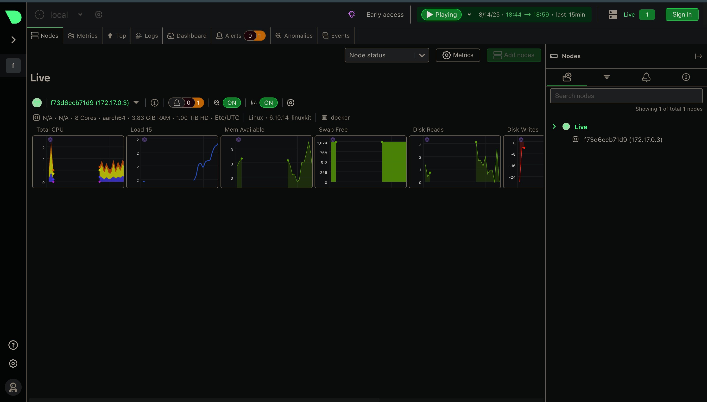
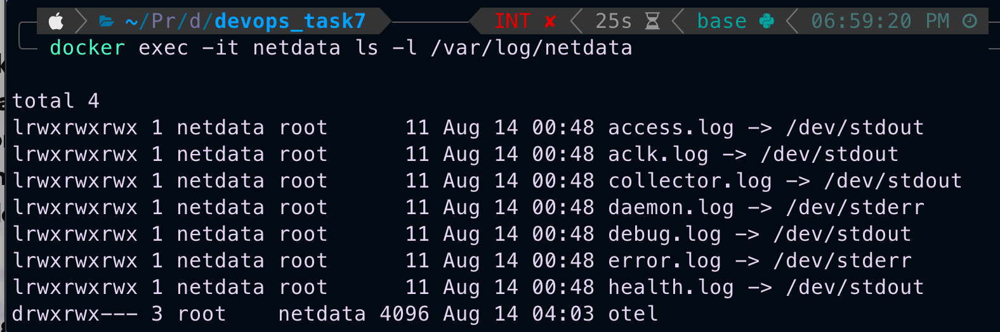

# Task 7: Monitor System Resources Using Netdata

## Objective
Install Netdata via Docker and visualize system performance metrics.

## Tools
- Netdata (Free, open-source monitoring tool)
- Docker

## Steps
1. **Run Netdata container**
    ```bash
    docker run -d \
      --name=netdata \
      -p 19999:19999 \
      --cap-add=SYS_PTRACE \
      --security-opt apparmor=unconfined \
      netdata/netdata
    ```

2. **Access Dashboard**
    - Local: http://localhost:19999
    - Remote: http://<server-ip>:19999

3. **View Metrics**
    - CPU, Memory, Disk, Network
    - Docker container stats

4. **Check Logs**
    ```bash
    docker exec -it netdata cat /var/log/netdata/access.log
    ```

## Screenshots
### Dashboard


### Access Log


## Outcome
Successfully monitored system resources using Netdata and explored logs for insights.

